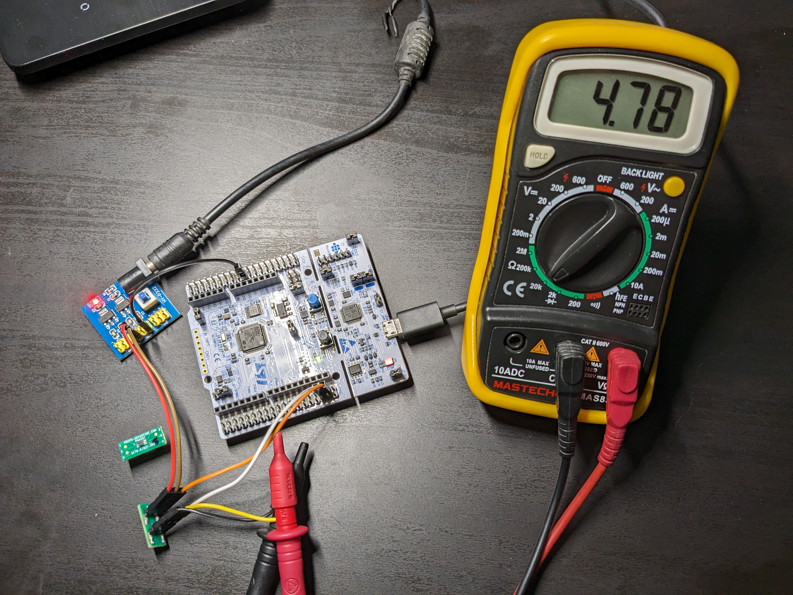
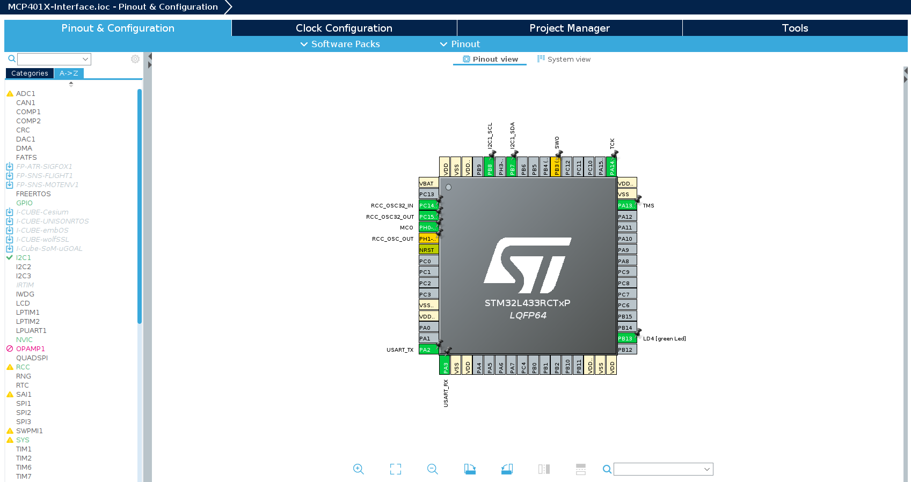
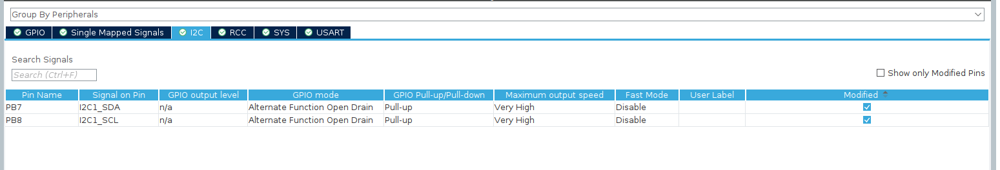

# MCP401X-STM32-Library-mcp4017-4018-4019-

Library and example to interface MCP401X series (MCP4017/4018/4019) digital potentiometers



## Getting Started

### Connection Diagram

Tested with [NUCLEO-L433RC-P](https://www.st.com/en/evaluation-tools/nucleo-l433rc-p.html) (STM32L433RCT6PU) on MCP4017 and MCP4018. 
- Vcc = 3.3V

|Sl No |      STM32                    |  MCP401X    |
|------|-------------------------------|-------------|                                   
| 1    | 3.3V                          | 1           |
| 2    | GND                           | 2           |
| 3    | SCL/D15(PB8)                  | 3           |
| 4    | SDA/D14(PB7)                  | 4           |

Measuring Resistance will depend on which MCP401X IC is being used. 
MCP4017 and MCP4019 are Rheostats, MCP4018 is a Potentiometer. Check [Datasheet](https://ww1.microchip.com/downloads/en/DeviceDoc/22147a.pdf) for pinouts.



I have used the internal pullups of STM32 for I2C



## Folder Structure

    .
    ├── Images
    ├── Workspace          				# STM32CubeIDE Workspace          
    │   └── MCP401X-Interface    		# Project
    │   	├── Core         
    │   	│	├── Inc 				# Header files
    │   	│	├── Src 				# Source files 
    │   	│ 	└── Startup
    │   	├── Debug  					# Binary files 
	│   	├── Drivers 
	│   	├── .cproject 
	│   	├── .mxproject 
	│   	├── .project 
	│   	├── MCP401X-Interface Debug.launch 
	│   	├── MCP401X-Interface.ioc 	# CubeMX file
	│ 		└── STM32L433RCTXP_FLASH.ld		
	├── examples                		 	
	│   └── main.c    					# example main.c
	├── LICENSE              			
	├── README.md             			
	├── mcp401x.c  						# Library source file 
	└── mcp401x.h  						# Library header file 
   

## Usage

### main.c

Include the header file #include "mcp401x.h" in main.c

```c
/* Private includes ----------------------------------------------------------*/
/* USER CODE BEGIN Includes */
#include "mcp401x.h"
/* USER CODE END Includes */
```
### Usage example of main.c

```c
uint8_t stepBuf[3] = {0, 64, 127};
uint8_t step = 0;
uint32_t Rwb;

SetStep(&stepBuf[0]);			//Set Min value Resistance
step = ReadStep();
//	HAL_Delay(5000);

SetStep(&stepBuf[1]);			//Set Middle value Resistance
step = ReadStep();
//  HAL_Delay(5000);

SetStep(&stepBuf[2]);			//Set Max value Resistance
step = ReadStep();
//	HAL_Delay(5000);

SetResistance(2500);			//Set Resistance value 2.5K
step = ReadStep();				//Read the step value
Rwb = ReadResistance();			//Read the Resistance value from chip
//	HAL_Delay(5000);
```

If you are using ST-Link/J-link to debug, use break points to see the value change, otherwise uncomment the HAL_Delay() function. 

### mcp401x.h

I am using the STM32L4 series,
```c
#include "stm32l4xx_hal.h"					//Change here acc to STM32 series used
```
If another STM32 series IC is used, include the appropriate header. For example if F1 series (like STM32F103C8T6) is used, replace with below 

```c
#include "stm32f1xx_hal.h"					//Change here acc to STM32 series used
```

Change Resistance value according to the MCP401X IC used. If a 5K Pot is being used, change below value to 5000 

```c
#define MAXRESISTANCE    	10000     		//Change here acc to Value of MCP401X
```

### mcp401x.c

Change Handletype acc to I2C used. Here I am using I2C1.

```c
extern I2C_HandleTypeDef hi2c1;
```

Function used to set step value. Change handletype acc to I2C used. If needed use custom timeout instead of HAL_MAX_DELAY

```c
/**
  * @brief  Set step value. Range 0 - 127
  * @retval None
  */
void SetStep(uint8_t *step)
{
	HAL_I2C_Master_Transmit(&hi2c1, MCP401XADDR, step, 1, HAL_MAX_DELAY);
}
```

Function used to read step value. Change handletype acc to I2C used. If needed use custom timeout instead of HAL_MAX_DELAY

```c
/**
  * @brief  Read step value. Range 0 - 127
  * @retval int
  */
int ReadStep(void)
{
	uint8_t tempBuf[1] = {0};
	HAL_I2C_Master_Receive(&hi2c1, MCP401XADDR, tempBuf, 1, HAL_MAX_DELAY);
	return *tempBuf;
}
```

Function used to set Resistance value. 

```c
/**
  * @brief  Set Resistance value, Rwb.
  * @retval None
  */
void SetResistance(uint32_t Rwb)
{
	uint8_t step = (((MAXSTEP * Rwb) / MAXRESISTANCE) + (Rwb / 1000));;
	if(step > 127)
	{
		step = 127;
	}
	SetStep(&step);
}

```

## Links to Hardware used

- NUCLEO-L433RC-P Board - https://www.st.com/en/evaluation-tools/nucleo-l433rc-p.html
- SC70-6 TO DIP-6 SMT Adapter - https://www.digikey.com/en/products/detail/chip-quik-inc/PA0087/5014718
- MCP4017T-502E/LT - https://www.digikey.com/en/products/detail/microchip-technology/MCP4017T-502E-LT/2059659
- MCP4018T-103E/LT - https://www.digikey.com/en/products/detail/microchip-technology/MCP4018T-103E-LT/2059661