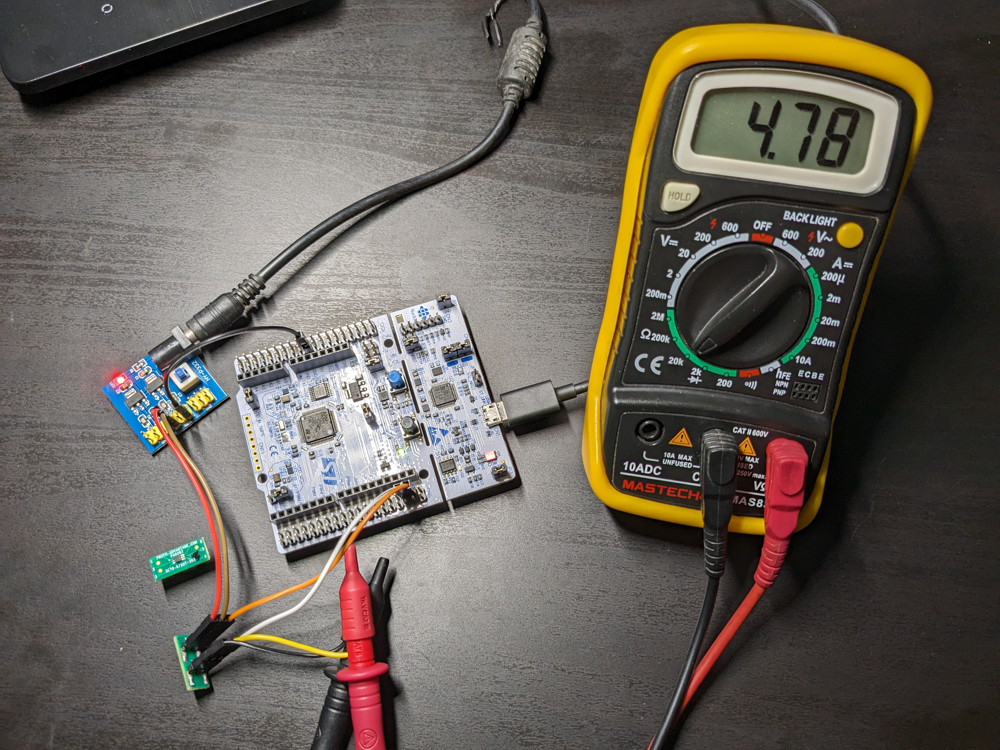

# MCP401X-STM32-Library-mcp4017-4018-4019-

Library and example to interface MCP401X series (MCP4017/4018/4019) digital potentiometers



## Getting Started

### Connection Diagram

Tested on [NUCLEO-L433RC-P](https://www.st.com/en/evaluation-tools/nucleo-l433rc-p.html) with STM32L433RCT6PU IC. Vcc = 3.3V

|Sl No |      STM32                    |  MCP401X    |
|------|-------------------------------|-------------|                                   
| 1    | 3.3V                          | 1           |
| 2    | GND                           | 2           |
| 3    | SCL/D15(PB8)                  | 3           |
| 4    | SDA/D14(PB7)                  | 4           |

Measuring Resistance will depend on which MCP401X IC is being used. 
MCP4017 and MCP4019 are Rheostats, MCP4018 is a Potentiometer. Check [Datasheet](https://ww1.microchip.com/downloads/en/DeviceDoc/22147a.pdf) for pinouts.


## Usage

### main.c

Include the header file #include "mcp401x.h" in main.c

```c
/* Private includes ----------------------------------------------------------*/
/* USER CODE BEGIN Includes */
#include "mcp401x.h"
/* USER CODE END Includes */
```
### Usage example of main.c

```c
	uint8_t stepBuf[3] = {0, 64, 127};
	uint8_t step = 0;
	uint32_t Rwb;

	SetStep(&stepBuf[0]);			//Set Min value Resistance
	step = ReadStep();
	//	HAL_Delay(5000);

	SetStep(&stepBuf[1]);			//Set Middle value Resistance
	step = ReadStep();
	//  HAL_Delay(5000);

	SetStep(&stepBuf[2]);			//Set Max value Resistance
	step = ReadStep();
	//	HAL_Delay(5000);

	SetResistance(2500);			//Set Resistance value 2.5K
	step = ReadStep();				//Read the step value
	Rwb = ReadResistance();			//Read the Resistance value from chip
	//	HAL_Delay(5000);
```

If you are using ST-Link/J-link to debug, use break points to see the value change, otherwise uncomment the HAL_Delay() function. 

### mcp401x.h

```c
#include "stm32l4xx_hal.h"					//Change here acc to STM32 series used
```
If another STM32 series is used, include the appropriate header. For example if F1 series (like STM32F103C8T6) is used, include 

```c
#include "stm32f1xx_hal.h"					//Change here acc to STM32 series used
```

Change Resistance value according to the MCP401X IC used. If a 5K Pot is being used, change below value to 5000 

```c
#define MAXRESISTANCE    	10000     		//Change here acc to Value of MCP401X
```